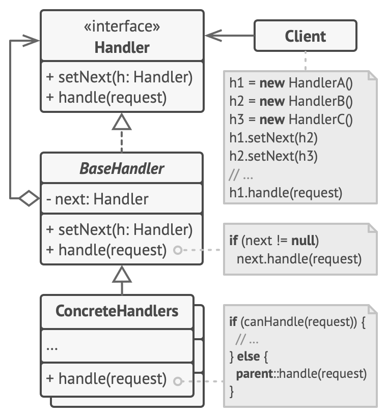
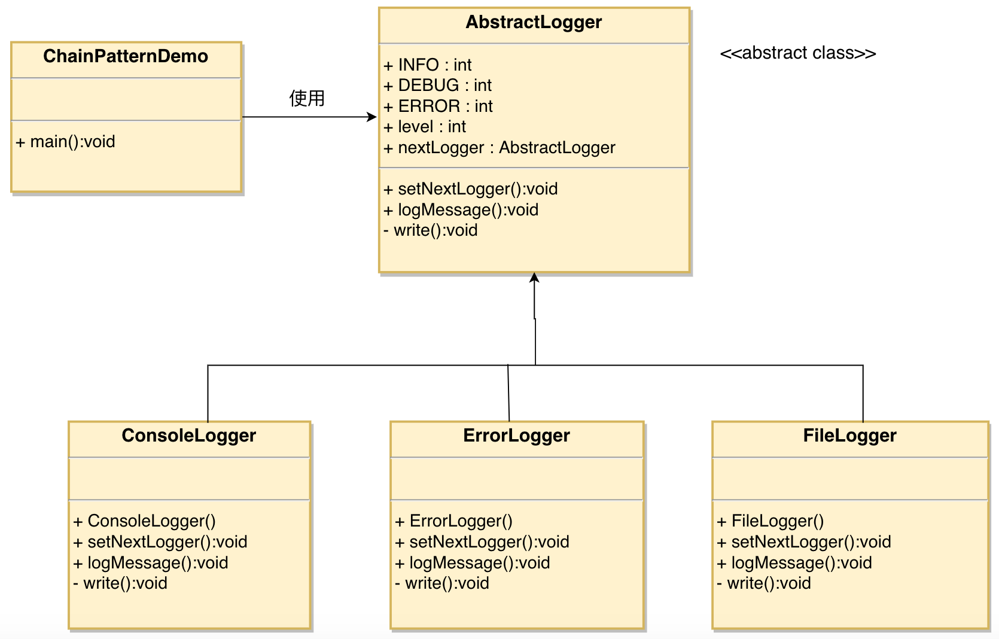

# 责任链模式（Chain of Responsibility Pattern）

Notes: emphasis on hierarchy. Interesting note is levels of debug is a hierarchy structure - if not pass, if not todo, if not warn then it is error --> hence, a hierarchy.
Need to modify 个人想法：责任链设计模式 VS if-else section to reflect this

- 定义：
  - 为请求创建了一个**接收者对象的链**
  - 通常每个接收者都包含对另一个接收者的引用。如果一个对象不能处理该请求，那么它会**把相同的请求传给下一个接收者**，依此类推
  - 注意：每个接受者的逻辑是 - 自己能否处理？如能就处理，如不能就传给下一个接受者；最终只有一个接受者“处理”

- 主要解决：
  - 避免请求发送者与接收者**耦合**在一起，**让多个对象都有可能接收请求**，将这些对象连接成一条链，并且沿着这条链传递请求，直到有对象处理它为止。
  - 客户只需要将请求发送到职责链上即可，无须关心请求的处理细节和请求的传递（所以职责链将请求的发送者和请求的处理者解耦了）

- 使用场景
  1. 有多个对象可以处理同一个请求，具体哪个对象处理该请求由运行时刻自动确定。 
  2. 在不明确指定接收者的情况下，向多个对象中的一个提交一个请求。 
  3. 可动态指定一组对象处理请求。

- 注意事项：在web中遇到很多应用

## 优缺点

- 优点
  - 单一职责原则 + 降低耦合度。它将请求的发送者和接收者解耦。
  - 开闭原则。 你可以在不更改现有代码的情况下在程序中新增处理者。 
    - 增强给对象指派职责的灵活性。通过改变链内的成员或者调动它们的次序，允许动态地新增或者删除责任。 
  - 简化了对象。使得对象不需要知道链的结构。 
  - 增加新的请求处理类很方便。
  - 你可以控制请求处理的顺序

- 缺点
  - 不能保证请求一定被接收。 
  - 系统性能将受到一定影响，而且在进行代码调试时不太方便，可能会造成循环调用。 
  - 可能不容易观察运行时的特征，有碍于除错。
  - 部分请求可能未被处理。

## 角色



- 处理者 （Handler） 
  - 具体处理者的通用接口。 
  - 该接口通常仅包含单个方法用于请求处理， 但有时其还会包含一个设置链上下个处理者的方法。

- 基础处理者 （Base Handler） 是一个可选的类
  - 你可以将所有处理者共用的样本代码放置在其中。
  - 通常情况下， 该类中定义了一个**保存对于下个处理者引用的成员变量**。 
  - 客户端可通过将处理者传递给上个处理者的构造函数或设定方法来创建链。 
  - 该类还可以实现**默认的处理行为**： 确定下个处理者存在后再将请求传递给它。

- 具体处理者 （Concrete Handlers） 
  - 包含处理请求的实际代码。
  - 每个处理者接收到请求后， 都必须决定是否进行处理， 以及是否沿着链传递请求。
  - 处理者通常是独立且不可变的， 需要通过构造函数一次性地获得所有必要地数据。

- 客户端 （Client） 
  - 可根据程序逻辑一次性或者动态地生成链。 
  - 值得注意的是， 请求可发送给链上的任意一个处理者， 而非必须是第一个处理者。

## 实现



```java
// Base Handler + Handler
public abstract class AbstractLogger {
   public static int INFO = 1;
   public static int DEBUG = 2;
   public static int ERROR = 3;
 
   protected int level;
 
   //责任链中的下一个元素
   protected AbstractLogger nextLogger; // base handler
 
   public void setNextLogger(AbstractLogger nextLogger){
      this.nextLogger = nextLogger;
   }
 
   // base handler
   public void logMessage(int level, String message){
      if(this.level <= level){
         write(message);
      }
      if(nextLogger !=null){
         nextLogger.logMessage(level, message);
      }
   }
 
   // handler
   abstract protected void write(String message);
}
```

```java
// Concrete Handlers
public class ConsoleLogger extends AbstractLogger {
   public ConsoleLogger(int level){
      this.level = level;
   }
 
   @Override
   protected void write(String message) {    
      System.out.println("Standard Console::Logger: " + message);
   }
}

public class ErrorLogger extends AbstractLogger {
   public ErrorLogger(int level){
      this.level = level;
   }
 
   @Override
   protected void write(String message) {    
      System.out.println("Error Console::Logger: " + message);
   }
}

public class FileLogger extends AbstractLogger {
   public FileLogger(int level){
      this.level = level;
   }
 
   @Override
   protected void write(String message) {    
      System.out.println("File::Logger: " + message);
   }
}
```

```java
public class ChainPatternDemo {
   
   private static AbstractLogger getChainOfLoggers(){
      AbstractLogger errorLogger = new ErrorLogger(AbstractLogger.ERROR);
      AbstractLogger fileLogger = new FileLogger(AbstractLogger.DEBUG);
      AbstractLogger consoleLogger = new ConsoleLogger(AbstractLogger.INFO);

      errorLogger.setNextLogger(fileLogger);
      fileLogger.setNextLogger(consoleLogger);
      /* 
      You can consider modifying the logic so the code is:
      return errorLogger.setNextLogger(fileLogger).setNextLogger(consoleLogger);
      */

      return errorLogger;  
   }
 
   public static void main(String[] args) {
      AbstractLogger loggerChain = getChainOfLoggers();
      loggerChain.logMessage(AbstractLogger.INFO, "This is an information."); 
      loggerChain.logMessage(AbstractLogger.DEBUG, 
         "This is a debug level information.");
      loggerChain.logMessage(AbstractLogger.ERROR, 
         "This is an error information.");
   }
}
```

Output:

```
Standard Console::Logger: This is an information.

File::Logger: This is a debug level information.
Standard Console::Logger: This is a debug level information.

Error Console::Logger: This is an error information.
File::Logger: This is an error information.
Standard Console::Logger: This is an error information.
```

# 扩展：纯与不纯责任链设计模式
- 参考 https://blog.csdn.net/mark_lq/article/details/48269831
  - 纯：要么承担全部责任，要么将责任推给下家
  - 不纯：允许某个请求被一个具体处理者部分处理后再向下传递

# 个人想法：责任链设计模式 VS if-else
- 当我们使用if-elseif-else，我们默认表达每个condition都是平等的，但很多时候这并非事实。大部分的if-elseif-else都是依赖着上个condition的失败，因此存在耦合。
- 因此，该时候用责任链设计模式比较适合；以实现解耦
- 启发：https://blog.csdn.net/u014116780/article/details/107583386?utm_medium=distribute.pc_relevant.none-task-blog-baidujs_title-1&spm=1001.2101.3001.4242

## if-elseif-else例子
```js
if(hasFourWheels)
  handleCar(..)
else if(hasWings)  # 默认 !hasFourWheels
  handlePlane(..)
else if(canFloat)  # 默认 !hasFourWheels and !hasWings
  handleBoat(..)
```

## 责任链设计模式例子
```js
// client
const carHandler = new carHandler();
const planeHandler = new PlaneHandler();
const boatHandler = new BoatHandler();

carHandler.setNextHandler(planeHandler);
planeHandler.setNextHandler(boatHandler);

carHandler.execute(data);

// carHandler
execute(data) => {
  if(hasFourWheels(data))
    // do something
  else
    nextHandler.execute(data)
}

// planeHandler
execute() => {
  if(!hasFourWheels(data) && hasWings(data))  // 不依赖car condition的失败
    // do something
  else
    nextHandler.execute(data)    
}
```

# TODO
- https://betterprogramming.pub/chain-of-responsibility-to-the-rescue-2288471c783b

# Sources
- https://www.runoob.com/design-pattern/chain-of-responsibility-pattern.html
- https://refactoringguru.cn/design-patterns/chain-of-responsibility
- https://blog.csdn.net/u014116780/article/details/107583386?utm_medium=distribute.pc_relevant.none-task-blog-baidujs_title-1&spm=1001.2101.3001.4242
- 不错的例子：https://blog.csdn.net/weixin_43905387/article/details/117255595?utm_medium=distribute.pc_relevant_t0.none-task-blog-2%7Edefault%7EBlogCommendFromMachineLearnPai2%7Edefault-1.control&depth_1-utm_source=distribute.pc_relevant_t0.none-task-blog-2%7Edefault%7EBlogCommendFromMachineLearnPai2%7Edefault-1.control
