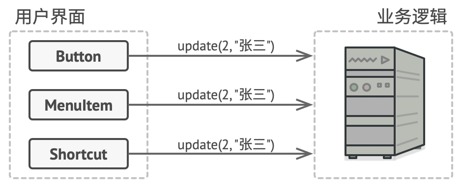
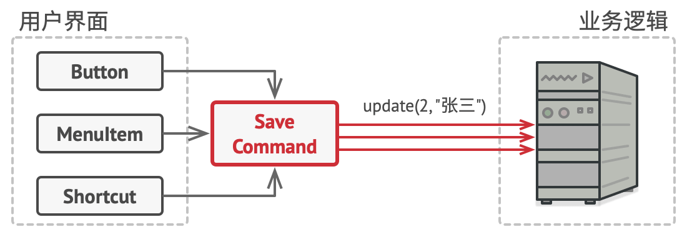
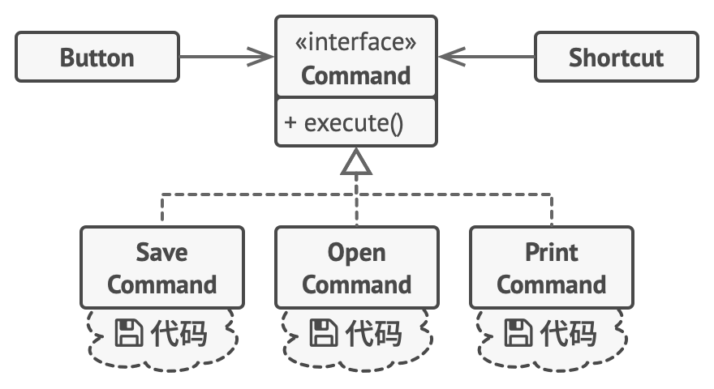
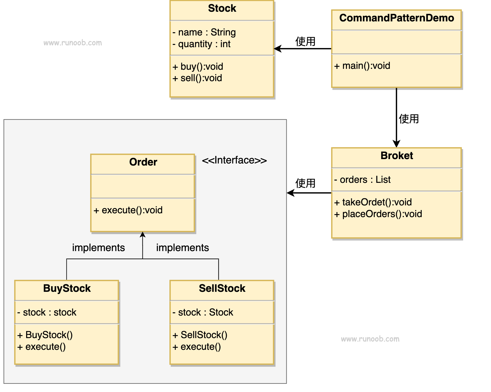

# 命令模式（Command Pattern）

- 定义
  - 将一个**请求封装成一个对象**，从而使您可以用不同的请求对客户进行参数化。
  - 在软件系统中，行为**请求者与行为实现者**通常是一种**紧耦合**的关系，但某些场合不太适合，比如：网页GUI
    - 正常方法是为每个GUI按钮创建一个类，该类存有按钮的功能代码
    - 第一个问题：会创建很多个类
    - 最大问题：如果有两个**同功能但位置不同**的按钮（如复制可以通过工具栏，也可以通过通过right-click的目录），就会有**重复代码**
  - 其实这样的设计本身就有问题；应该**按照操作实现功能代码**，而不是直接放在按钮类里
    - 
      - 每个GUI对应的类直接执行按钮的功能代码（存有重复代码）
    - 
      - 使用命令设计模式，把存储功能封装成一个类，所有按钮使用该类
  - 设计图
    - 
  - 解耦合：使用命令设计模式后，GUI只需负责GUI相关的，而不需管按钮的功能代码；功能代码类不需管GUI方面，只需管自己负责的功能

- 实际例子
  - 餐厅：客户的订单是命令，服务员（类似于GUI）把订单给厨房，厨房（类似于功能代码类）接到订单就直接煮对应的菜，煮完后给服务员把菜送到客户

- 优点
  1. 单一职责原则
      - 降低了触发和执行操作的类的**耦合**度。
  2. 开闭原则
      - 你可以在不修改已有客户端代码的情况下在程序中**创建新的命令**。
      - 要创建新命令也很容易
  3. 可以实现撤销和恢复、延迟功能。
  4. 可以将一组简单命令组合成一个复杂命令

- 缺点
  1. 代码可能会变得**更加复杂**， 因为你在发送者和接收者之间增加了一个全新的层次。
      - 使用命令模式可能会导致某些系统有**过多的具体命令类**。

- 实用场景：
  - 如果你想要将操作**放入队列中**、 操作的执行或者**远程执行**操作， 可使用命令模式。
  - 如果你想要实现操作**回滚**功能， 可使用命令模式。

- 角色
  - 

  - 发送者 （Sender）（亦称 “触发者 （Invoker）”）类
    - 负责对请求进行**初始化**
    - 其中必须包含一个成员变量来存储对于命令对象的引用。 
    - 发送者触发命令， 而不向接收者直接发送请求。 
    - 注意， 发送者并不负责创建命令对象： 它通常会通过构造函数从客户端处获得预先生成的命令。

  - 命令 （Command） 接口
    - 通常仅声明一个执行命令的方法。

  - 具体命令 （Concrete Commands） 
    - 会实现各种类型的请求。 
    - 具体命令自身并不完成工作， 而是会**将调用委派给一个业务逻辑对象**。 但为了简化代码， **这些类可以进行合并**。
    - 接收对象执行方法所需的**参数**可以声明为具体命令的成员变量。 
    - 你可以将命令对象设为不可变， 仅允许通过构造函数对这些成员变量进行初始化。

  - 接收者 （Receiver） 类
    - 包含部分业务逻辑（就是最终被影响的类）
    - 几乎任何对象都可以作为接收者。
    - 绝大部分命令只处理如何将请求传递到接收者的细节， 接收者自己会完成实际的工作。

  - 客户端 （Client）
    - 会创建并配置具体命令对象。
    - 客户端必须将包括接收者实体在内的所有请求参数传递给命令的构造函数。
    - 此后， 生成的命令就可以与一个或多个发送者相关联了。

## 实现（简单）

- 

```java
// Command Interface
public interface Order {
   void execute();
}
```

```java
// receiver
public class Stock {
   private String name = "ABC";
   private int quantity = 10;

   public void buy(){
      System.out.println("Stock [ Name: "+name+", 
         Quantity: " + quantity +" ] bought");
   }
   public void sell(){
      System.out.println("Stock [ Name: "+name+", 
         Quantity: " + quantity +" ] sold");
   }
}
```

```java
// Concrete Commands
public class BuyStock implements Order {
   private Stock abcStock;
 
   public BuyStock(Stock abcStock){
      this.abcStock = abcStock;
   }
 
   public void execute() {
      abcStock.buy();
   }
}

public class SellStock implements Order {
   private Stock abcStock;
 
   public SellStock(Stock abcStock){
      this.abcStock = abcStock;
   }
 
   public void execute() {
      abcStock.sell();
   }
}
```

```java
// client
import java.util.ArrayList;
import java.util.List;
 
public class Broker {
   private List<Order> orderList = new ArrayList<Order>(); 
 
   public void takeOrder(Order order){
      orderList.add(order);      
   }
 
   public void placeOrders(){
      for (Order order : orderList) {
         order.execute();
      }
      orderList.clear();
   }
}
```

```java
// (higher level) client
public class CommandPatternDemo {
   public static void main(String[] args) {
      Stock abcStock = new Stock();
      Broker broker = new Broker();

      broker.takeOrder(new BuyStock(abcStock));
      broker.takeOrder(new SellStock(abcStock));
      broker.placeOrders();
   }
}
```

## 实现（复杂点）

- 

```
# 命令基类会为所有具体命令定义通用接口 (Command interface)
abstract class Command is
    protected field app: Application
    protected field editor: Editor
    protected field backup: text

    constructor Command(app: Application, editor: Editor) is
        this.app = app
        this.editor = editor

    // 备份编辑器状态。
    method saveBackup() is
        backup = editor.text

    // 恢复编辑器状态。
    method undo() is
        editor.text = backup

    // 执行方法被声明为抽象以强制所有具体命令提供自己的实现。该方法必须根
    // 据命令是否更改编辑器的状态返回 true 或 false。
    abstract method execute()


// 这里是具体命令 (Concrete Command)
class CopyCommand extends Command is
    // 复制命令不会被保存到历史记录中，因为它没有改变编辑器的状态。
    method execute() is
        app.clipboard = editor.getSelection()
        return false

class CutCommand extends Command is
    // 剪切命令改变了编辑器的状态，因此它必须被保存到历史记录中。只要方法
    // 返回 true，它就会被保存。
    method execute() is
        saveBackup()
        app.clipboard = editor.getSelection()
        editor.deleteSelection()
        return true

class PasteCommand extends Command is
    method execute() is
        saveBackup()
        editor.replaceSelection(app.clipboard)
        return true

// 撤销操作也是一个命令。
class UndoCommand extends Command is
    method execute() is
        app.undo()
        return false


// 全局命令历史记录就是一个堆桟。
class CommandHistory is
    private field history: array of Command

    // 后进...
    method push(c: Command) is
        // 将命令压入历史记录数组的末尾。

    // ...先出
    method pop():Command is
        // 从历史记录中取出最近的命令。


// 编辑器类包含实际的文本编辑操作。它会担任接收者的角色：最后所有命令都会
// Receiver
// 将执行工作委派给编辑器的方法。
class Editor is
    field text: string

    method getSelection() is
        // 返回选中的文字。

    method deleteSelection() is
        // 删除选中的文字。

    method replaceSelection(text) is
        // 在当前位置插入剪贴板中的内容。

// 应用程序类会设置对象之间的关系。它会担任发送者的角色：当需要完成某些工
// Client
// 作时，它会创建并执行一个命令对象。
class Application is
    field clipboard: string
    field editors: array of Editors
    field activeEditor: Editor
    field history: CommandHistory

    // 将命令分派给 UI 对象的代码可能会是这样的。
    method createUI() is
        // ...
        copy = function() { executeCommand(
            new CopyCommand(this, activeEditor)) }
        copyButton.setCommand(copy)
        shortcuts.onKeyPress("Ctrl+C", copy)

        cut = function() { executeCommand(
            new CutCommand(this, activeEditor)) }
        cutButton.setCommand(cut)
        shortcuts.onKeyPress("Ctrl+X", cut)

        paste = function() { executeCommand(
            new PasteCommand(this, activeEditor)) }
        pasteButton.setCommand(paste)
        shortcuts.onKeyPress("Ctrl+V", paste)

        undo = function() { executeCommand(
            new UndoCommand(this, activeEditor)) }
        undoButton.setCommand(undo)
        shortcuts.onKeyPress("Ctrl+Z", undo)

    // 执行一个命令并检查它是否需要被添加到历史记录中。
    method executeCommand(command) is
        if (command.execute)
            history.push(command)

    // 从历史记录中取出最近的命令并运行其 undo（撤销）方法。请注意，你并
    // 不知晓该命令所属的类。但是我们不需要知晓，因为命令自己知道如何撤销
    // 其动作。
    method undo() is
        command = history.pop()
        if (command != null)
            command.undo()
```

## Sources

- https://refactoringguru.cn/design-patterns/command
- https://www.runoob.com/design-pattern/command-pattern.html
