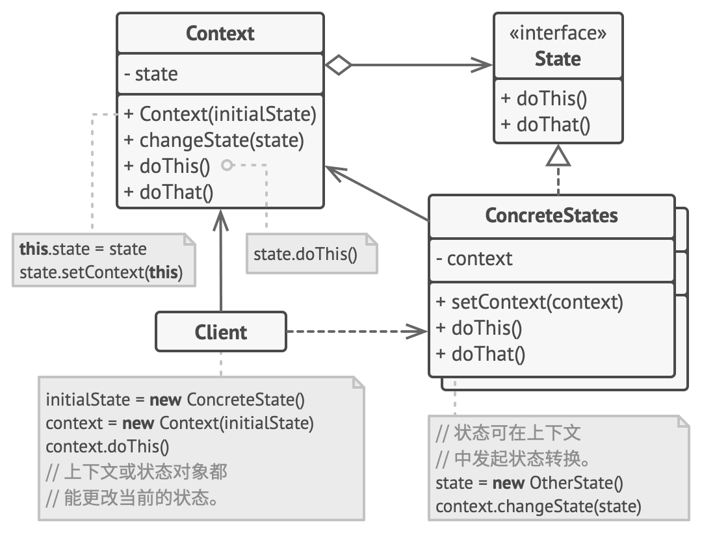

# 状态模式（State Pattern）

- 定义
  - **对象的行为依赖于它的状态（属性）**
  - 在状态模式中，我们创建表示各种状态的对象和一个行为随着状态对象改变而改变的 context 对象。

- 例子：
  - 打篮球的时候运动员可以有正常状态、不正常状态和超常状态

- 优点
  - 单一职责原则：将与特定状态相关的代码放在单独的类中。
  - 开闭原则：无需修改已有状态类和上下文就能引入新状态（**但其实这个要根据实现，可能是个缺点**）
  - 通过消除臃肿的状态机条件语句简化上下文代码。
- 缺点
  - 如果状态机只有很少的几个状态，或者很少发生改变， 那么应用该模式可能会显得小题大作。
  - 状态模式对"开闭原则"的支持并不太好，对于可以切换状态的状态模式，增加新的状态类需要修改那些负责状态转换的源代码，否则无法切换到新增状态，而且修改某个状态类的行为也需修改对应类的源代码。

## 角色



- 上下文 （Context）
  - **保存**了对于一个**具体状态对象**的引用， 并会将所有与该状态相关的工作委派给它。
  - 上下文通过状态接口与状态对象交互， 且会提供一个设置器用于传递新的状态对象。

- 具体状态 （Concrete States）
  - 状态对象可存储对于上**下文对象的反向引用**。
  - 状态可以通过该引用从上下文处获取所需信息， 并且**能触发状态转移**。

## 实现


- 这里的AudioPlayer是Context角色

```
// 音频播放器（Audio­Player）类即为上下文。它还会维护指向状态类实例的引用，
// 该状态类则用于表示音频播放器当前的状态。
class AudioPlayer is
    field state: State
    field UI, volume, playlist, currentSong

    constructor AudioPlayer() is
        this.state = new ReadyState(this)

        // 上下文会将处理用户输入的工作委派给状态对象。由于每个状态都以不
        // 同的方式处理输入，其结果自然将依赖于当前所处的状态。
        UI = new UserInterface()
        UI.lockButton.onClick(this.clickLock)
        UI.playButton.onClick(this.clickPlay)
        UI.nextButton.onClick(this.clickNext)
        UI.prevButton.onClick(this.clickPrevious)

    // 其他对象必须能切换音频播放器当前所处的状态。
    method changeState(state: State) is
        this.state = state

    // UI 方法会将执行工作委派给当前状态。
    method clickLock() is
        state.clickLock()
    method clickPlay() is
        state.clickPlay()
    method clickNext() is
        state.clickNext()
    method clickPrevious() is
        state.clickPrevious()

    // 状态可调用上下文的一些服务方法。
    method startPlayback() is
        // ...
    method stopPlayback() is
        // ...
    method nextSong() is
        // ...
    method previousSong() is
        // ...
    method fastForward(time) is
        // ...
    method rewind(time) is
        // ...


// 所有具体状态类都必须实现状态基类声明的方法，并提供反向引用指向与状态相
// 关的上下文对象。状态可使用反向引用将上下文转换为另一个状态。
abstract class State is
    protected field player: AudioPlayer

    // 上下文将自身传递给状态构造函数。这可帮助状态在需要时获取一些有用的
    // 上下文数据。
    constructor State(player) is
        this.player = player

    abstract method clickLock()
    abstract method clickPlay()
    abstract method clickNext()
    abstract method clickPrevious()


// 具体状态会实现与上下文状态相关的多种行为。
class LockedState extends State is

    // 当你解锁一个锁定的播放器时，它可能处于两种状态之一。
    method clickLock() is
        if (player.playing)
            player.changeState(new PlayingState(player))
        else
            player.changeState(new ReadyState(player))

    method clickPlay() is
        // 已锁定，什么也不做。

    method clickNext() is
        // 已锁定，什么也不做。

    method clickPrevious() is
        // 已锁定，什么也不做。


// 它们还可在上下文中触发状态转换。
class ReadyState extends State is
    method clickLock() is
        player.changeState(new LockedState(player))

    method clickPlay() is
        player.startPlayback()
        player.changeState(new PlayingState(player))

    method clickNext() is
        player.nextSong()

    method clickPrevious() is
        player.previousSong()


class PlayingState extends State is
    method clickLock() is
        player.changeState(new LockedState(player))

    method clickPlay() is
        player.stopPlayback()
        player.changeState(new ReadyState(player))

    method clickNext() is
        if (event.doubleclick)
            player.nextSong()
        else
            player.fastForward(5)

    method clickPrevious() is
        if (event.doubleclick)
            player.previous()
        else
            player.rewind(5)
```

- 强制改State：

```
PlayingState playingState = new PlayingState(audioPlayer);
audioPlayer.setState(playingState);
```

## 讨论：状态vs策略模式

- 状态可被视为**策略的扩展**
- 两者都基于组合机制：它们都通过将部分工作委派给 **“帮手”** 对象来改变其在不同情景下的行为：
  - **策略**使得这些对象相互**之间完全独立**；它们**不知道其他对象的存在**。
  - 但**状态**模式**没有限制具体状态之间的依赖**， 且允许它们在不同情景下**自行改变的状态**。

## Sources
- https://www.runoob.com/design-pattern/state-pattern.html
- https://refactoringguru.cn/design-patterns/state