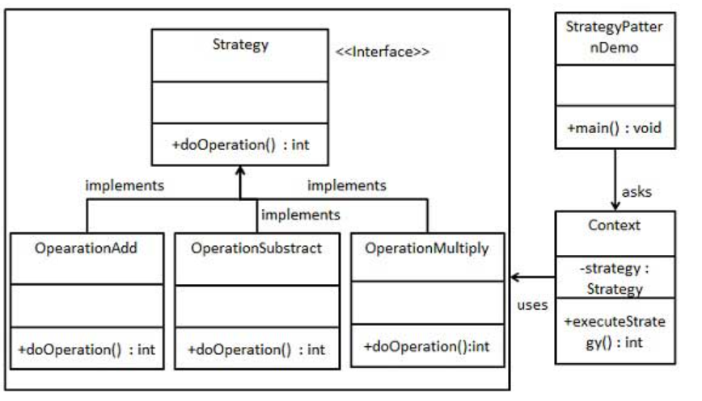

# 策略模式（Strategy Pattern）

- 定义
  - 定义一系列的算法，把它们一个个封装起来，并且使它们可相互替换

- 主要解决
  - 在有多种算法相似的情况下，使用 if...else 所带来的复杂和难以维护

- 现实例子：旅行的出游方式，选择骑自行车、坐汽车，每一种旅行方式都是一个策略

## 优缺点

- 优点
  - 可以在运行时切换对象内的算法
  - 将算法的实现和使用算法的代码隔离开来
  - 免使用多重条件判断
  - 扩展性良好
    - 开闭原则。 你无需对上下文进行修改就能够引入新的策略。

- 缺点
  - 客户端必须知晓策略间的不同——它需要选择合适的策略。
  - 如果你的算法极少发生改变， 那么没有任何理由引入新的类和接口。 使用该模式只会让程序过于复杂
  - 策略类会增多
  - 所有策略类都需要对外暴露

## 角色


- 上下文 （Context）
  - 维护指向具体策略的引用， 且仅通过策略接口与该对象进行交流。
- 策略 （Strategy）
  - 具体策略的通用接口
- 具体策略 （Concrete Strategies）
  - 实现了上下文所用算法的各种不同变体。
- 客户端 （Client）
  - 会创建一个特定策略对象并将其传递给上下文。 上下文则会提供一个设置器以便客户端在运行时替换相关联的策略。

## 实现



```
// 策略接口声明了某个算法各个不同版本间所共有的操作。上下文会使用该接口来
// 调用有具体策略定义的算法。
interface Strategy is
    method execute(a, b)
```

```
// 具体策略会在遵循策略基础接口的情况下实现算法。该接口实现了它们在上下文
// 中的互换性。
class ConcreteStrategyAdd implements Strategy is
    method execute(a, b) is
        return a + b

class ConcreteStrategySubtract implements Strategy is
    method execute(a, b) is
        return a - b

class ConcreteStrategyMultiply implements Strategy is
    method execute(a, b) is
        return a * b
```

```
// 上下文定义了客户端关注的接口。
class Context is
    // 上下文会维护指向某个策略对象的引用。上下文不知晓策略的具体类。上下
    // 文必须通过策略接口来与所有策略进行交互。
    private strategy: Strategy

    // 上下文通常会通过构造函数来接收策略对象，同时还提供设置器以便在运行
    // 时切换策略。
    method setStrategy(Strategy strategy) is
        this.strategy = strategy

    // 上下文会将一些工作委派给策略对象，而不是自行实现不同版本的算法。
    method executeStrategy(int a, int b) is
        return strategy.execute(a, b)
```

```
// 客户端代码会选择具体策略并将其传递给上下文。客户端必须知晓策略之间的差
// 异，才能做出正确的选择。
class ExampleApplication is
    method main() is
        // 创建上下文对象。
        // 读取第一个数。
        // 读取最后一个数。
        // 从用户输入中读取期望进行的行为。

        if (action == addition) then
            context.setStrategy(new ConcreteStrategyAdd())

        if (action == subtraction) then
            context.setStrategy(new ConcreteStrategySubtract())

        if (action == multiplication) then
            context.setStrategy(new ConcreteStrategyMultiply())

        result = context.executeStrategy(First number, Second number)

        // 打印结果
```

## 讨论：strategy vs command vs chain of responsibility

- 说真的， 我觉得从代码来说责任链和策略是有点多，虽然这样，我觉得到最后还是要看每个设计模式背后的意思；如：策略模式代表每个策略都可以替换使用，策略们都在做同一个事情，只是方法不同而已。

## 扩展：使用工厂模式 + 策略模式

```js
algorithmsInterface selectedAlgorithm = algorithmFactory.getAlgorithm(strategyname);
selectedAlgorithm.doTheJob(commonParameter);
```

## 扩展：让strategyInterface做算法，concreteStrategy

```java
// Strategy Interface
package ifs;

public abstract class InsuranceStrategy {
    public double calculateInsuranceVeryHigh(double income) {
        return (income - getAdjustment()) * getWeight() + getConstant();
    }

    public abstract int getConstant();
    public abstract double getWeight();
    public abstract int getAdjustment();
}
```

```java
// Concrete Strategy
package ifs;

public class InsuranceStrategyMedium extends InsuranceStrategy {
    @Override
    public int getConstant() {
        return 35600;
    }

    @Override
    public double getWeight() {
        return 0.2;
    }

    @Override
    public int getAdjustment() {
        return 10000;
    }
}
```

## Sources
- https://refactoringguru.cn/design-patterns/strategy
- https://www.runoob.com/design-pattern/strategy-pattern.html
- Interesting discussion between strategy pattern; esp about People from the US are addressed as Mr/Ms/Mrs, People from Mexico are addressed as Senor/Senorita/Senora: https://softwareengineering.stackexchange.com/questions/418391/advantages-of-strategy-design-pattern-versus-simple-if-else
- Interesting usage: each strategy controls a variable and abstract class does the calculation, can prevent re-writing the same calculation logic: https://www.jetbrains.com/help/idea/replace-conditional-logic-with-strategy-pattern.html
- Interesting fix ifelse method: https://betterprogramming.pub/chain-of-responsibility-to-the-rescue-2288471c783b
