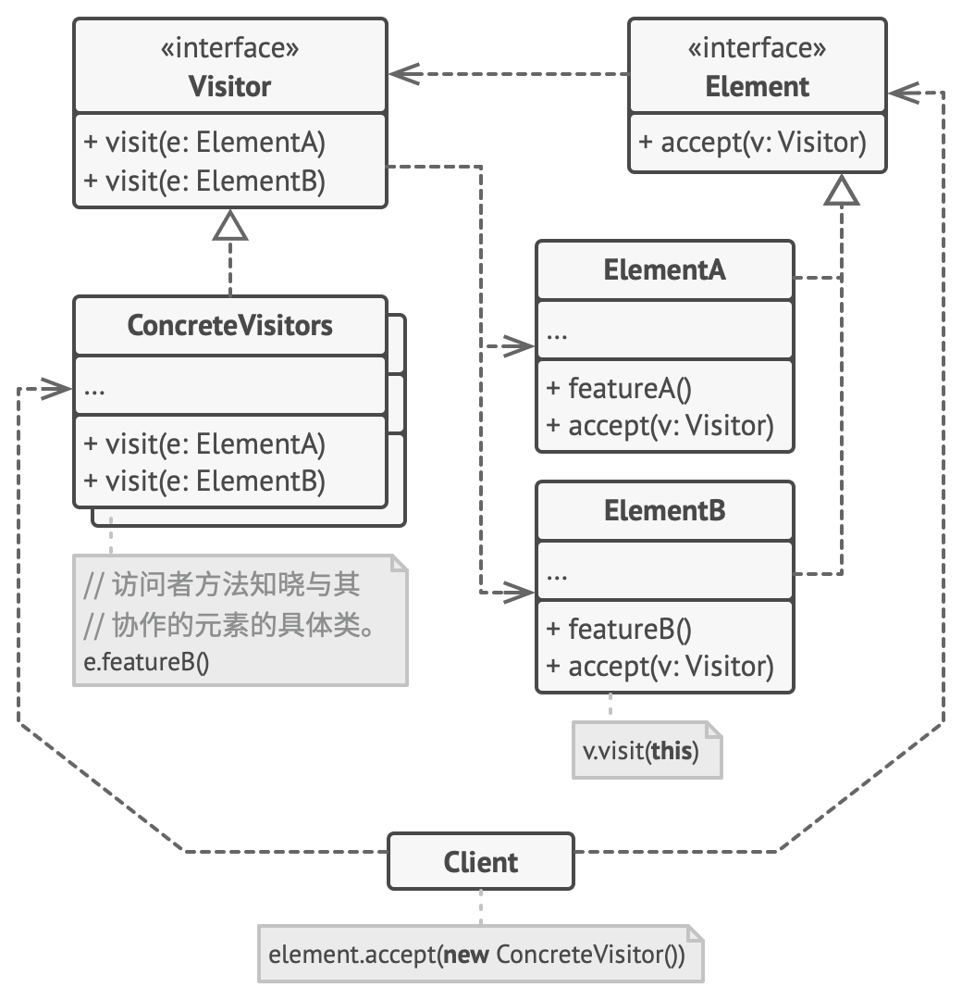

# 访问者模式（Visitor Pattern）

- 定义
  - 能将数据结构与数据操作分离
  - 何时使用：需要对一个对象结构中的对象进行很多不同的并且不相关的操作，而需要避免让这些操作"污染"这些对象的类，使用访问者模式将这些封装到类中。
  - 如何解决：在数据基础类里面有一个方法接受访问者，将自身引用传入访问者。

- 例子：
  - 您在朋友家做客，您是访问者，朋友接受您的访问，您通过朋友的描述，然后对朋友的描述做出一个判断，这就是访问者模式。
  - 地图上有几个节点，你需要输出不同格式（如：pdf, xml.etc）的文件来代表所有节点和他们之间的关系（edges)；每个格式是一个访问者

- 优点
  - 开闭原则：你可以引入在不同类对象上执行的新行为， 且无需对这些类做出修改。
  - 单一职责原则：可将同一行为的不同版本移到同一个类中。
  - 访问者对象可以在与各种对象交互时收集一些有用的信息。 当你想要遍历一些复杂的对象结构 （例如对象树）， 并在结构中的每个对象上应用访问者时， 这些信息可能会有所帮助。

- 缺点
  - 每次在元素层次结构中添加或移除一个类时， 你都要更新所有的访问者。
  - 在访问者同某个元素进行交互时， 它们**可能没有访问元素私有**成员变量和方法的必要**权限**。
  - 具体元素对访问者公布细节，违反了迪米特原则
  - 违反了依赖倒置原则，依赖了具体类，没有依赖抽象。

## 角色



- 访问者 （Visitor）、具体访问者 （Concrete Visitor） 
  - 接口声明了一系列**以元素成员为参数**的**访问者方法**。
  - 
    - 如果编程语言支持重载， 这些方法的名称可以是相同的， 但是其参数一定是不同的。

- 具体访问者 （Concrete Visitor） 
  - 会为不同元素类读取元素的attribute

- 元素 （Element） 接口
  - 声明了一个**方法来 “接收” 访问者**。 

- 具体元素 （Concrete Element） 
  - 必须实现接收方法。 
  - 该方法的目的是**根据当前元素类，调用相应访问者方法**。 


## 实现


```
// 元素接口声明了一个`accept（接收）`方法，它会将访问者基础接口作为一个参
// 数。
interface Shape is
    method move(x, y)
    method draw()
    method accept(v: Visitor)

// 每个具体元素类都必须以特定方式实现`accept`方法，使其能调用相应元素类的
// 访问者方法。
class Dot implements Shape is
    // ...

    // 注意我们正在调用的`visitDot（访问点）`方法与当前类的名称相匹配。
    // 这样我们能让访问者知晓与其交互的元素类。
    method accept(v: Visitor) is
        v.visitDot(this)

class Circle implements Shape is
    // ...
    method accept(v: Visitor) is
        v.visitCircle(this)

class Rectangle implements Shape is
    // ...
    method accept(v: Visitor) is
        v.visitRectangle(this)

class CompoundShape implements Shape is
    // ...
    method accept(v: Visitor) is
        v.visitCompoundShape(this)
```

```
// 访问者接口声明了一组与元素类对应的访问方法。访问方法的签名能让访问者准
// 确辨别出与其交互的元素所属的类。
interface Visitor is
    method visitDot(d: Dot)
    method visitCircle(c: Circle)
    method visitRectangle(r: Rectangle)
    method visitCompoundShape(cs: CompoundShape)

// 具体访问者实现了同一算法的多个版本，而且该算法能与所有具体类进行交互。
//
// 访问者模式在复杂对象结构（例如组合树）上使用时能发挥最大作用。在这种情
// 况下，它可以存储算法的一些中间状态，并同时在结构中的不同对象上执行访问
// 者方法。这可能会非常有帮助。
class XMLExportVisitor implements Visitor is
    method visitDot(d: Dot) is
        // 导出点（dot）的 ID 和中心坐标。

    method visitCircle(c: Circle) is
        // 导出圆（circle）的 ID 、中心坐标和半径。

    method visitRectangle(r: Rectangle) is
        // 导出长方形（rectangle）的 ID 、左上角坐标、宽和长。

    method visitCompoundShape(cs: CompoundShape) is
        // 导出图形（shape）的 ID 和其子项目的 ID 列表。
```

```
// 客户端代码可在不知晓具体类的情况下在一组元素上运行访问者操作。“接收”操
// 作会将调用定位到访问者对象的相应操作上。
class Application is
    field allShapes: array of Shapes

    method export() is
        exportVisitor = new XMLExportVisitor()

        foreach (shape in allShapes) do
            shape.accept(exportVisitor)
```

