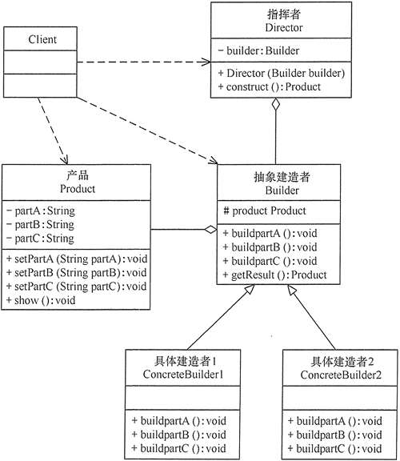

# 建造者模式（Bulider Pattern)
 - 就如计算机是由CPU、主板、内存等部件组装而成的，在软件开发过程中，有时需要创建一个复杂的对象，也是由多个子部件组装而成的。
   - 例如，计算机是由CPU、主板、内存等部件组装而成的
   - 这类产品的创建无法用工厂模式，只能用建造者模式。

 - 建造者（Builder）模式和工厂模式的关注点不同：
   - 建造者模式**注重**零部件(parts)的**组装过程**
   - 而工厂方法模式更注重零部件的**创建过程**
   - 但两者可以结合使用。

 - 定义：
   - 它是将一个复杂的对象分解为多个简单的对象，然后一步一步构建而成。
   - 产品的组成部分是不变的，但每一部分是可以灵活选择的。
   - 将构造复杂对象的过程和组成对象的部件解耦

## 优缺点
 - 优点
   - 封装性好，构建和表示分离。
   - 扩展性好，各个具体的建造者相互独立，有利于系统的解耦。 
   - 客户端不必知道产品内部组成的细节，建造者可以对创建过程逐步细化，而不对其它模块产生任何影响，便于控制细节风险。
 - 缺点
   - 产品的组成部分必须相同，这限制了其使用范围。
   - 如果产品的内部变化复杂，如果产品内部发生变化，则建造者也要同步修改，后期维护成本较大。

## 角色
 - 产品角色（Product）：
   - 它是包含多个组成部件的复杂对象，由具体建造者来创建其各个零部件。
 - 抽象建造者（Builder）：
   - 它是一个包含创建产品各个子部件的**抽象方法**的接口
   - 通常还包含一个返回复杂产品的方法 getResult()。
 - 具体建造者(Concrete Builder）：
   - 实现 Builder 接口
 - 指挥者（Director）：
   - 它调用建造者(Builder)的装配方法（buildXXX()）来创建产品
   - 在指挥者中不涉及具体产品的信息



## 实现

### 简化版

```java
public class Product {
    private final String partA;//必须
    private final String partB;//可选
    private final String partC;//可选

    private Product(Builder builder){
        this.partA=builder.partA;
        this.partB=builder.partB;
        this.partC=builder.partC;
    }

    public String toString(){
      return this.partA + ", " + this.partB + ", " + this.partC;
    }

    public static class Builder{
        private String partA;//必须
        private String partB;//可选
        private String partC;//可选

        public Builder(String partA){
            this.partA = partA;
        }

        public Builder setPartB(String partB) {
            this.partB = partB;
            return this;
        }

        public Builder setPartC(String partC) {
            this.partC = partC;
            return this;
        }

        public Product build(){
            return new Product(this);
        }
    }
  //省略getter方法

  public static void main(String[] args){
    Product product = new Product.Builder("this is partA")
                    .setPartB("this is part B")
                    .setPartC("this is part C")
                    .build();
    System.out.println(product.toString());
  
  }
}
```

### 复杂版

```java
// 产品角色
class Product {
    private String partA;
    private String partB;
    private String partC;

    public void setPartA(String partA) {
      this.partA = partA;
    }

    public void setPartB(String partB) {
      this.partB = partB;
    }

    public void setPartC(String partC) {
      this.partC = partC;
    }

    public void show() {
      //显示产品的特性
      System.out.println("partA = " + partA + ", partB = " + partB + ", partC = " + partC);
    }
}

// 抽象建造者
abstract class Builder {
    //创建产品对象
    protected Product product = new Product();

    public abstract void buildPartA();
    public abstract void buildPartB();
    public abstract void buildPartC();

    //返回产品对象
    public Product getResult() {
      return product;
    }
}

// 具体建造者
public class ConcreteBuilder1 extends Builder {
    public void buildPartA() {
      product.setPartA("建造 PartA");
    }

    public void buildPartB() {
      product.setPartB("建造 PartB");
    }

    public void buildPartC() {
      product.setPartC("建造 PartC");
    }
}

public class ConcreteBuilder2 extends Builder {
    public void buildPartA() {
      product.setPartA("建造 PartA(2)");
    }

    public void buildPartB() {
      product.setPartB("建造 PartB(2)");
    }

    public void buildPartC() {
      product.setPartC("建造 PartC(2)");
    }
}

// 指挥者
class Director {
    private Builder builder;

    public Director(Builder builder) {
      this.builder = builder;
    }

    //产品构建与组装方法
    public Product construct() {  // can add parameters here too
      builder.buildPartA();
      builder.buildPartB();
      builder.buildPartC();
      return builder.getResult();
    }
}

// main
Director director = new Director(new ConcreteBuilder1());
Product product1 = director1.construct();
product1.show();

director = new Director(new ConcreteBuilder2());
Product product2 = director.construct();
product2.show();
```

### Variation
 - Actually, there are MANY MANY MANY small variations to builder pattern, for example:

```java
// 指挥者
class Director {
    private Builder builder;

    public Director() {
    }

    //产品构建与组装方法
    public Product build(Builder builder) {
      builder.buildPartA();
      builder.buildPartB();
      builder.buildPartC();
      return builder.getResult();
    }
}

// main
Director director = new Director();

Product product1 = director.build(new ConcreteBuilder1());
product1.show();

Product product2 = director.build(new ConcreteBuilder2());
product2.show();
```