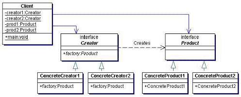

# 工厂模式（Factory Pattern）
 - 是Java 中最常用的设计模式之一
 - 在创建对象时**不会对客户端暴露创建逻辑**，并且是通过使用一个共同的接口来指向新创建的对象。
 - 分为三类:
   1. 简单工厂模式(Simple Factory)
   2. 工厂方法模式(Factory Method)
   3. 抽象工厂模式(Abstract Factory)
   - 这三种模式从上到下逐步抽象，并且更具一般性。

# 简单工厂模式(Simple Factory)
 - 又被称为静态工厂方法模式
 - 适合在明确地**计划不同条件下创建不同实例**的时候使用
 - 怎么是实现？
   - 定义一个抽象产品类，让其描述具体产品类的特性和功能；定义一个工厂类，按照客户提供的信息创建具体产品并返回
 - 应用场景
   - 对于产品种类相对较少的情况，考虑使用简单工厂模式。
   - 使用简单工厂模式的客户端只需要传入工厂类的参数，不需要关心如何创建对象的逻辑，可以很方便地创建所需产品。
 - 例子：
   - 您需要一辆汽车，可以直接从工厂里面提货，而不用去管这辆汽车是怎么做出来的，以及这个汽车里面的具体实现。 

## 优缺点
 - 优点：
   - 工厂类包含必要的逻辑判断，可以决定在什么时候创建哪一个产品的实例。客户端可以免除直接创建产品对象的职责，很方便的创建出相应的产品。工厂和产品的职责区分明确。
   - 客户端无需知道所创建具体产品的类名，只需知道参数即可。
   - 也可以引入配置文件，在不修改客户端代码的情况下更换和添加新的具体产品类。
 - 缺点：
   - 只有一个工厂，一个工厂负责所有产品的创建，职责过重，一旦异常，整个系统将受影响。且工厂类代码会非常臃肿，违背高聚合原则。
   - 系统扩展困难，一旦增加新产品不得不修改工厂逻辑，在产品类型较多时，可能造成逻辑过于复杂
 - （不能理解的缺点）
   - 【不懂】简单工厂模式使用了 static 工厂方法，造成工厂角色无法形成基于继承的等级结构。
   - 【不是所有工厂方式都这样吗】使用简单工厂模式会增加系统中类的个数（引入新的工厂类），增加系统的复杂度和理解难度

## 角色
 - 抽象产品角色
 - 具体产品角色
 - 工厂角色（静态）


## 实现

```java
// 抽象产品角色 (Shape.java)
public interface Shape {
  void draw();
}

// 【产品1】具体产品角色（Rectangle.java)
public class Rectangle implements Shape {
  @Override
  public void draw(){
    System.out.println("Drawing Rectangle");
  }
}

// 【产品2】具体产品角色（Square.java)
public class Square implements Shape {
  @Override
  public void draw(){
    System.out.println("Drawing Square");
  }
}

// 工厂角色 (ShapeFactory.java)
public class ShapeFactory{
  public Shape getShape(String shape){
    if(shape == null)
      return null
    
    switch(shape){
      case "rectangle":
        return new Rectangle();
      case "square":
        return new Square();
      default:
        return null;
    }
  }
}

// (main.java)
public static void main(String[] args){
  ShapeFactory factory = new ShapeFactory();

  Rectangle rectangle = factory.getShape("rectangle");
  rectangle.draw();

  Square square = factory.getShape("square");
  square.draw();
}
```

# 工厂方法模式 (Factory Method Pattern)

 - 也被称为虚拟构造器(Virtual Constructor)，多态工厂模式（Polymorphic Factory）
 - 是简单工厂模式的衍生；但核心工厂类不再负责所有产品的创建，而是成为一个抽象工厂角色，仅负责具体工厂子类必须实现的接口
   - 这样进一步抽象化的好处是提升了扩展性
     - **不修改具体工厂角色的情况下引进新的产品**；创建具体产品和具体的工厂对象，实现相应的接口就行了
     - 符合了”开放-封闭原则“ （OCP open close principle）
       - 开放是指可扩展性好；封闭是指不用修改原来的代码

## 优缺点

 - 优点：
   - 用户只需要知道具体工厂的名称就可得到所要的产品，无须知道产品的具体创建过程。
   - 灵活性增强，对于新产品的创建，只需多写一个相应的工厂类。
   - 典型的解耦框架。高层模块只需要知道产品的抽象类，无须关心其他实现类，满足迪米特法则、依赖倒置原则和里氏替换原则。
 - 缺点：
   - 类的个数容易过多，增加复杂度
   - 增加了系统的抽象性和理解难度
   - 抽象产品只能生产一种产品，此弊端可使用抽象工厂模式解决。
 - 应用场景：
   - 客户只知道创建产品的工厂名，而不知道具体的产品名。如 TCL 电视工厂、海信电视工厂等。
   - 创建对象的任务由多个具体子工厂中的某一个完成，而抽象工厂只提供创建产品的接口。
   - 客户不关心创建产品的细节，只关心产品的品牌

## 角色
 - 抽象工厂角色
   - 工厂方法模式的核心，任何工厂类都必须实现这个接口。
 - 具体工厂角色
   - 抽象工厂的一个实现，负责实例化产品对象。
 - 抽象产品角色（跟简单工厂模式一样）
 - 具体产品角色（跟简单工厂模式一样）



## 实现

```java
// 抽象产品角色
public interface Fruit {
	public void get();
}

// 抽象工厂角色
public interface FruitFactory {
	public Fruit getFruit();
}

// 【产品1】具体产品角色
public class Apple implements Fruit {
	@Override
	public void get() {
		System.out.println("获得苹果");
	}
}

// 【产品1】具体工厂角色
public class AppleFactory implements FruitFactory {
	@Override
	public Fruit getFruit() {
		return new Apple();
	}
}

// 【产品2】具体产品角色
public class Banana implements Fruit {
	@Override
	public void get() {
		System.out.println("获得香蕉");
	}
}

// 【产品2】具体工厂角色
public class BananaFactory implements FruitFactory {
	@Override
	public Fruit getFruit() {
		return new Banana();
	}
}

// main
public static void main(String[] args) throws InstantiationException, IllegalAccessException {
  // 获得苹果工厂
  FruitFactory appleFactory = new AppleFactory();
  Fruit apple = appleFactory.getFruit();
  apple.get();

  // 获得香蕉工厂
  FruitFactory bananaFactory = new BananaFactory();
  Fruit banana = bananaFactory.getFruit();
  banana.get();
}
```

# 抽象工厂模式 (Abstract Factory Pattern)
 - 基本观念：
   - **同等级**：可以理解为同样类型的产品，比如：海尔电视和TCL电视都是电视，所以是同等级的
   - **产品族**：可以理解为同一个品牌，因此在同一个工厂生产的产品

 - 抽象工厂模式是**工厂方法模式的升级版本**
   - 工厂方法模式只生产一个等级的产品
   - 而抽象工厂模式抽象工厂模式提供一个可以创建多个产品族中的产品的接口，

 - 下方的图所示的是海尔工厂和 TCL 工厂所生产的电视机与空调对应的关系图。


 - 使用抽象工厂模式一般要满足以下条件：
   - 系统中有**多个产品族**，每个具体工厂创建同一族但属于不同等级结构的产品。
   - 系统一次只可能消费其中某一族产品，即同族的产品一起使用。


## 优缺点

 - 优点：
   - 抽象工厂模式除了具有工厂方法模式的优点外，其他主要优点如下：
   - 可以在类的内部对产品族中相关联的多等级产品共同管理，而不必专门引入多个新的类来进行管理。
   - 当需要产品族时，抽象工厂可以保证客户端始终只使用同一个产品的产品组。
   - 抽象工厂增强了程序的可扩展性，当增加一个新的产品族时，不需要修改原代码，满足开闭原则。

 - 缺点：
   - 当产品族中需要增加一个新的产品时，所有的工厂类都需要进行修改。增加了系统的抽象性和理解难度。

## 角色
 - 核心工厂角色
   - 按照客户提供的信息创建某个产品族的工厂实例
 - 抽象工厂角色
   - 定义一个具体工厂可以创建哪些产品
 - 具体工厂角色
   - 抽象工厂的一个实现，负责实例化某个产品族中的产品对象。
 - 抽象产品角色
   - 定义了产品的规范，描述了产品的主要特性和功能，抽象工厂模式有多个抽象产品。
 - 具体产品角色
   - 抽象产品的具体实例。


## 实现

```java
// 【产品1】的抽象产品接口
public interface Television {
   void watch();
}

// 【产品族1，产品1】的抽象产品
public class HaierTV implements Television {
   @Override
   public void watch() {
      System.out.println("Watching haier TV!");
   }
}
//  【产品族2，产品1】的抽象产品
public class TclTV implements Television {
   @Override
   public void watch() {
      System.out.println("Watching tcl TV!");
   }
}

// 【产品2】的抽象产品接口
public interface AirConditioner {
   void run();
}

//【产品族1，产品2】的抽象产品接口
public class HaierAirConditioner implements AirConditioner {
   @Override
   public void run() {
      System.out.println("Running haier air conditioner");
   }
}

//【产品族2，产品2】的抽象产品接口
public class TclAirConditioner implements AirConditioner {
   @Override
   public void fill() {
      System.out.println("Running tcl air conditioner");
   }
}

// 抽象工厂（接口）
public abstract class AbstractFactory {
   public abstract AirConditioner getAC();
   public abstract Television getTV();
}

// 【产品族1】具体工厂
public class HaierFactory extends AbstractFactory {
   @Override
   public HaierTV getTV(){
      return new HaierTV();
   }
   
   @Override
   public HaierAirConditioner getAC() {
      return new HaierAirConditioner();
   }
}

// 【产品族2】具体工厂
public class TclFactory extends AbstractFactory {
   @Override
   public TclTV getTV(){
      return TclTV();
   }
   
   @Override
   public TclAirConditioner getAC() {
      return TclAirConditioner();
   }
}

// 核心工厂（FactoryProducer）
public class FactoryProducer {
   public static AbstractFactory getFactory(String choice){
      if(choice.equalsIgnoreCase("haier")){
         return new HaierFactory();
      } else if(choice.equalsIgnoreCase("tcl")){
         return new TclFactory();
      }
      return null;
   }
}

// main
public static void main(String[] args) {
  AbstractFactory haierFactory = FactoryProducer.getFactory("haier");
  Television haierTV = haierFactory.getTV();
  AirConditioner haierAirConditioner = haierAirConditioner.getAC();

  AbstractFactory tclFactory = FactoryProducer.getFactory("tcl");
  Television tclTV = tclFactory.getTV();
  AirConditioner tcpAirConditioner = tclFactory.getAC();
}
```

# 值得想的问题：
 - 简单工厂模式与工厂方法模式真正的避免了代码的改动了?
   - 没有。在简单工厂模式中， 新产品的加入要修改工厂角色中的判断语句;而在工厂方法模式中，要么将判断逻辑留在抽 象工厂角色中，要么在客户程序中将具体工厂角色写死(就象上面的例子一样)。而且产品 对象创建条件的改变必然会引起工厂角色的修改。 
   - 面对这种情况，Java 的反射机制与配置文件的巧妙结合突破了限制——这在 Spring 中 完美的体现了出来。
