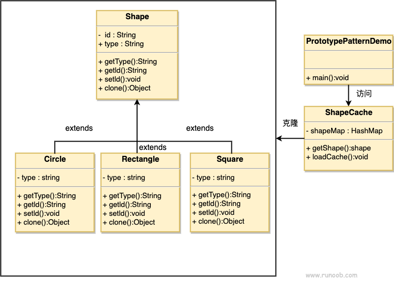

# 原型模式（Prototype Pattern）
 - 在有些系统中，存在大量相同或相似对象的创建问题，如果用传统的构造函数来创建对象，会比较复杂且耗时耗资源，用原型模式生成对象就很高效
 
 - 定义：
   - 用一个已经创建的实例作为原型，通过**复制**该原型对象来创建一个和原型相同或相似的新对象(**克隆**)
   - 用这种方式创建对象非常高效
     - 例如，Windows 操作系统的安装通常较耗时，如果复制就快了很多。在生活中复制的例子非常多，这里不一一列举了。
   - 此外，一个对象需要在一个高代价的数据库操作之后被创建。我们可以缓存该对象，在下一个请求时返回它的克隆，在需要的时候更新数据库，以此来减少数据库调用。

 - Java中提供了 clone()方法来实现对象的克隆，所以 Prototype 模式实现变得很简单。
   - 注：clone()方法的使用，请参考《Thinking in Java》或者《Effective Java》，对于许多原型模式中讲 到的浅克隆、深克隆，本文不作为谈论话题。
 - 原型管理器只需要一个就够了，所以可以使用单例模式来实现控制

## 优缺点
 - 优点：
   - Java 自带的原型模式基于内存二进制流的复制，在性能上比直接 new 一个对象更加优良。
   - 可以使用深克隆方式保存对象的状态，使用原型模式将对象复制一份，并将其状态保存起来，简化了创建对象的过程，以便在需要的时候使用（例如恢复到历史某一状态），可辅助实现撤销操作。

 - 缺点：
   - 需要为每一个类都配置一个 clone 方法
   - clone 方法位于类的内部，当对已有类进行改造的时候，需要修改代码，违背了开闭原则。
   - 当实现深克隆时，需要编写较为复杂的代码，而且当对象之间存在多重嵌套引用时，为了实现深克隆，每一层对象对应的类都必须支持深克隆，实现起来会比较麻烦。因此，深克隆、浅克隆需要运用得当。

## 角色
 - 抽象原型类：
   - 规定了具体原型对象必须实现的接口。
   - Java 中的 Cloneable 接口是抽象原型类。
 - 具体原型类：
   - 实现抽象原型类的 clone() 方法，它是可被复制的对象。
 - 访问类/原型管理器（Prototype Manager）
   - 把产品存储在一个 Hashtable 中，并在请求的时候返回它们的克隆。



## 实现

### Example 1

```java
// 抽象原型类
public abstract class Shape implements Cloneable {
   private String id;
   protected String type;
   
   abstract void draw();
   
   public String getType(){
      return type;
   }
   
   public String getId() {
      return id;
   }
   
   public void setId(String id) {
      this.id = id;
   }
   
   public Object clone() {
      Object clone = null;
      try {
         clone = super.clone();
      } catch (CloneNotSupportedException e) {
         e.printStackTrace();
      }
      return clone;
   }
}

// 具体原型类
public class Rectangle extends Shape {
   public Rectangle(){
     type = "Rectangle";
   }
 
   @Override
   public void draw() {
      System.out.println("Inside Rectangle::draw() method.");
   }
}

public class Square extends Shape {
   public Square(){
     type = "Square";
   }
 
   @Override
   public void draw() {
      System.out.println("Inside Square::draw() method.");
   }
}

public class Circle extends Shape {
   public Circle(){
     type = "Circle";
   }
 
   @Override
   public void draw() {
      System.out.println("Inside Circle::draw() method.");
   }
}

// 访问点
import java.util.Hashtable;
public class ShapeCache {
   private static Hashtable<String, Shape> shapeMap = new Hashtable<String, Shape>();
 
   public static Shape getShape(String shapeId) {
      Shape cachedShape = shapeMap.get(shapeId);
      return (Shape) cachedShape.clone();
   }
 
   // 对每种形状都运行数据库查询，并创建该形状
   // shapeMap.put(shapeKey, shape);
   // 例如，我们要添加三种形状
   public static void loadCache() {
      circle.setId("1");
      shapeMap.put(circle.getId(), new Circle());
 
      square.setId("2");
      shapeMap.put(square.getId(), new Square());
 
      rectangle.setId("3");
      shapeMap.put(rectangle.getId(), new Rectangle());
   }
}

// main
ShapeCache.loadCache();

Shape clonedShape = (Shape) ShapeCache.getShape("1");
System.out.println("Shape : " + clonedShape.getType());        

Shape clonedShape2 = (Shape) ShapeCache.getShape("2");
System.out.println("Shape : " + clonedShape2.getType());        

Shape clonedShape3 = (Shape) ShapeCache.getShape("3");
System.out.println("Shape : " + clonedShape3.getType());        
```

### Example 2

 - 客户自定义新的产品对象时，同时向原型管理器注册一个原型对象
 - 
```java
class PrototypeManager {
  private static PrototypeManager pm; 
  private Map prototypes=null; 

  private PrototypeManager() {
    prototypes = new HashMap(); 
  }

  //使用单例模式来得到原型管理器的唯一实例 
  public static PrototypeManager getManager() {
    if(pm == null) {
      pm = new PrototypeManager();
    }
    return pm; 
  }

  public void register(String name , Object prototype) { 
    prototypes.put(name , prototype);
  }
  
  public void unregister(String name) {
    prototypes.remove(name); 
  }

  public Prototype getPrototype(String name) { 
    if(prototypes.containsKey(name)) {
      //将清单中对应原型的复制品返回给客户
      return (Prototype) ((Prototype)prototypes.get(name)).clone(); 
    } else {
      Prototype object=null; 
      try {
        // use reflection here.
        object = (Prototype)Class.forName(name).newInstance();
        register(name , object); 
      } catch(Exception e) {
        System.err.println("Class "+name+"没有定义!"); 
      }
    
      return object;  
    }
  }
}

// main
Prototype p1 = PrototypeManager.getManager().getPrototype(“ConcretePrototype”);
```

## 总结
 - 由于 clone 方法在 java 实现中有着一定的弊端和风险，所以 clone 方法是不建议使用的。
 - 因此很少能在 java 应用中看到原型模式的使用。

## 进阶阅读
原型模式也称为克隆模式，如果您想深入了解原型（克隆）模式，可以猛击阅读下面的文章。
 - 《浅克隆和深克隆》
 - 《克隆会破坏单例对象吗》
 - 《原型模式在JDK源码中的应用》

