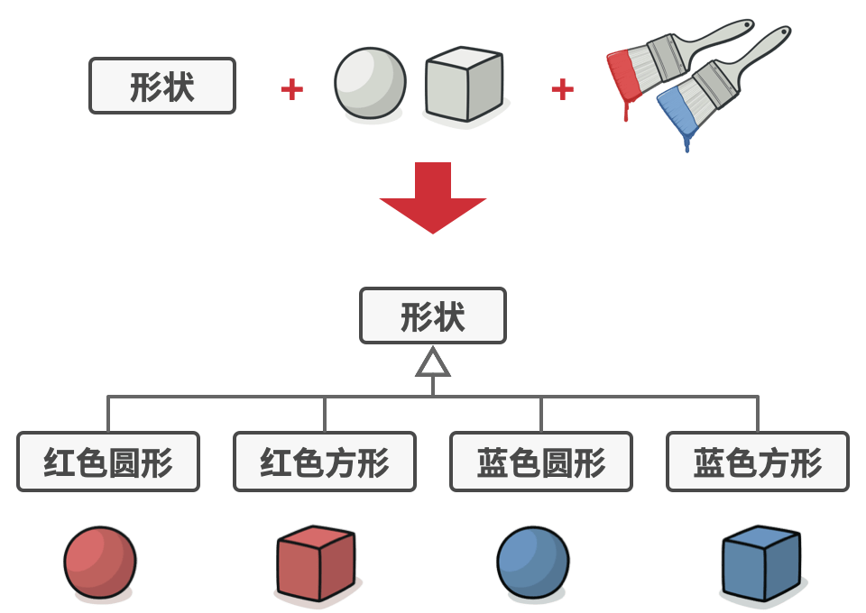
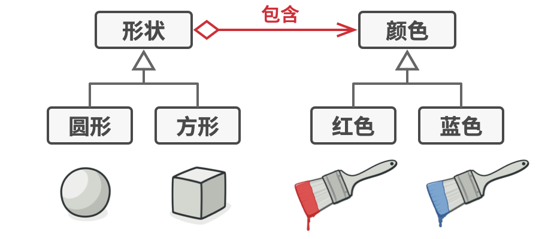
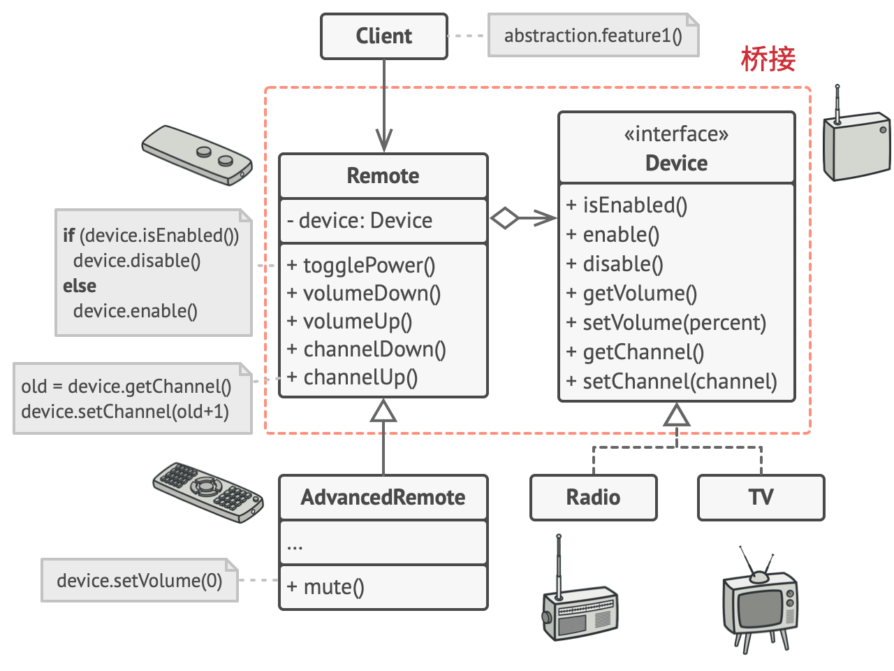

# 桥接模式（bridge pattern）

- 定义
  - 将**抽象部分与实现部分分离**，使它们都可以独立的变化。
  - （何时使用）实现系统可能有**两个角度分类**（>2个应该不行），每一种角度都可能变化。
    - （主要解决）在有2种可能会变化的情况下，用继承会造成类爆炸问题，扩展起来不灵活。
    - （如何解决）把**两种角度分类分离出来**，让它们独立变化，**减少**它们之间**耦合**。

- 很多人**混淆桥接模式和策略模式**的主要原因：在运行时可以切换不同实现方法
  - 记住， 设计模式并不仅是一种对类进行组织的方式， 它还能用于沟通意图和解决问题。

- 优点
  - 客户端代码仅与高层抽象部分进行互动， 不会接触到平台的详细信息。
  - 开闭原则：你可以新增抽象部分和实现部分， 且它们之间不会相互影响。
  - 单一职责原则：抽象部分专注于处理高层逻辑， 实现部分处理平台细节。

- 缺点
  - 对高内聚（high cohesion: 软件模块是由相关性很强的代码组成）的类使用该模式可能会让代码更加复杂。

## 例子：（形状Shape类）
  - [第一角度] 形状（Shape）类有很多**实现**：圆形（Circle）和方形（Square）
  - [第二角度] 每个星创都可以有不同**颜色**；可以是红色或蓝色
  - 用正常情况，我们需要用 m*n 个类型



- - 但可以用桥接模式；只需要 m+n 个类



## 抽象vs实现部分

其实我觉得这个名字起的很差，容易误导

- **抽象部分** （也被称为接口） 
  - 是一些实体的**高阶控制层**。 
  - 该层**自身不完成任何具体的工作**， 它需要将工作**委派给实现部分层**（也被称为平台）。

- 在实际的程序中
  - **抽象**部分是图形**用户界面 （GUI）**
  - 而**实现**部分则是**底层操作系统代码 （API）**
  - **GUI 层调用 API**层来对用户的各种操作做出响应。

- 一般来说， 你可以在两个独立方向上扩展这种应用：
  - 开发多个不同的 GUI （例如面向普通用户和管理员进行分别配置）
  - 支持多个不同的 API （例如， 能够在 Windows、 Linux 和 macOS 上运行该程序）

## 角色


- 抽象部分 （Abstraction）
  - 提供高层控制逻辑， 依赖于完成底层实际工作的实现对象。

- 实现部分 （Implementation）
- 具体实现 （Concrete Implementations）
  - 包括特定于平台的代码。
- 精确抽象 （Refined Abstraction）
  - 提供控制逻辑的**变体/扩展**。
  - 与其父类一样， 它们通过通用实现接口与不同的实现进行交互。
- 客户端 （Client）
  - 在通常情况下仅关心如何与抽象部分合作。
  - 但是， 客户端需要将抽象对象与一个实现对象连接起来。

## 实现



```
// “抽象部分”定义了两个类层次结构中“控制”部分的接口。它管理着一个指向“实
// 现部分”层次结构中对象的引用，并会将所有真实工作委派给该对象。
class RemoteControl is
    protected field device: Device
    constructor RemoteControl(device: Device) is
        this.device = device
    method togglePower() is
        if (device.isEnabled()) then
            device.disable()
        else
            device.enable()
    method volumeDown() is
        device.setVolume(device.getVolume() - 10)
    method volumeUp() is
        device.setVolume(device.getVolume() + 10)
    method channelDown() is
        device.setChannel(device.getChannel() - 1)
    method channelUp() is
        device.setChannel(device.getChannel() + 1)


// 你可以独立于设备类的方式从抽象层中扩展类。
class AdvancedRemoteControl extends RemoteControl is
    method mute() is
        device.setVolume(0)
```

```
// “实现部分”接口声明了在所有具体实现类中通用的方法。它不需要与抽象接口相
// 匹配。实际上，这两个接口可以完全不一样。通常实现接口只提供原语操作，而
// 抽象接口则会基于这些操作定义较高层次的操作。
interface Device is
    method isEnabled()
    method enable()
    method disable()
    method getVolume()
    method setVolume(percent)
    method getChannel()
    method setChannel(channel)


// 所有设备都遵循相同的接口。
class Tv implements Device is
    // ...

class Radio implements Device is
    // ...
```

```
// 客户端代码中的某个位置。
tv = new Tv()
remote = new RemoteControl(tv)
remote.togglePower()

radio = new Radio()
remote = new AdvancedRemoteControl(radio)
```

## Sources

- https://www.runoob.com/design-pattern/bridge-pattern.html
- https://refactoringguru.cn/design-patterns/bridge
