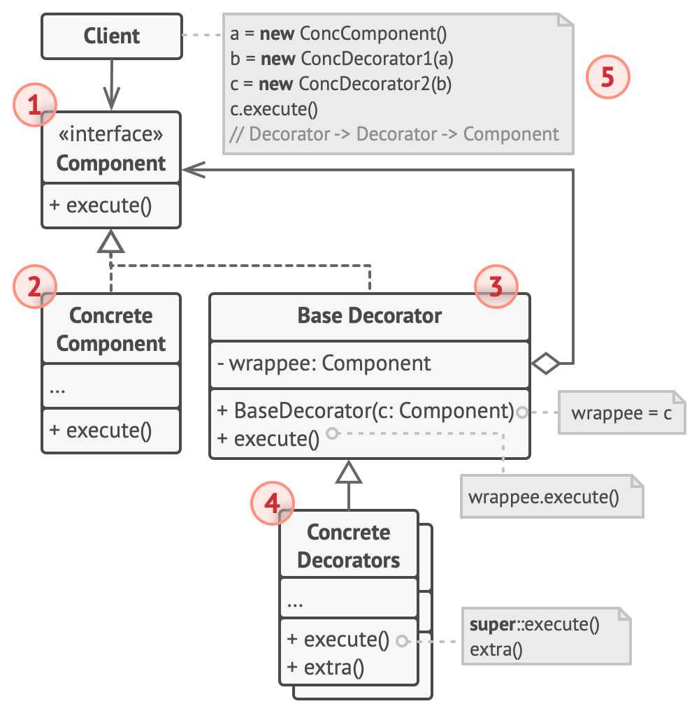

# 装饰器模式（Decorator Pattern）

- 定义
  - 向一个现有的对象**添加新的功能**，同时又**不改变其结构**
  - 可代替继承
    - 为了扩展一个类经常使用继承方式实现，由于继承为类引入静态特征，并且随着扩展功能的增多，子类会很膨胀，装修器模式可以解决该问题。
    - （无法继承的情况）许多编程语言使用final最终关键字来限制对某个类的进一步扩展。 复用最终类已有行为的唯一方法是使用装饰模式： 用封装器对其进行封装。

- 优点
  - 装饰类和被装饰类可以独立发展，不会相互耦合，装饰模式是继承的一个替代模式，装饰模式可以动态扩展一个实现类的功能。
    - 你可以在运行时添加或删除对象的功能。
  - 你可以用多个装饰封装对象来组合几种行为。
  - 单一职责原则。 你可以将实现了许多不同行为的一个大类拆分为多个较小的类

- 缺点
  - 多层装饰比较复杂

- 角色
  - 
  - 部件 （Component） ：
    - 声明封装器和被封装对象的公用接口。
  - 具体部件 （Concrete Component） 类
    - 是被封装对象所属的类。 它定义了**基础行为， 但装饰类可以改变这些行为**
  - 基础装饰 （Base Decorator） 类
    - 拥有一个指向被封装对象的引用成员变量。 该变量的类型应当被声明为通用部件接口， 这样它就可以引用具体的部件和装饰。 装饰基类会将所有操作委派给被封装的对象。
  - 具体装饰类 （Concrete Decorators）
    - 定义了可动态添加到部件的额外行为。 **具体装饰类会重写装饰基类的方法**， 并在调用父类方法之前或之后进行额外的行为。
  - 客户端 （Client）
    - 可以使用多层装饰来封装部件， 只要它能使用通用接口与所有对象互动即可。

## 实现
- 

```java
// (Component Interface)
public interface Shape {
   void draw();
}
```

```java
// (Concrete Component)
public class Rectangle implements Shape {
   @Override
   public void draw() {
      System.out.println("Shape: Rectangle");
   }
}
```

```java
// (Concrete Component)
public class Circle implements Shape {
   @Override
   public void draw() {
      System.out.println("Shape: Circle");
   }
}
```

```java
// (Base Decorator)
public abstract class ShapeDecorator implements Shape {
   protected Shape decoratedShape;
 
   public ShapeDecorator(Shape decoratedShape){
      this.decoratedShape = decoratedShape;
   }
 
   public void draw(){
      decoratedShape.draw();
   }  
}
```

```java
// (Concrete Decorator)
public class RedShapeDecorator extends ShapeDecorator {
 
   public RedShapeDecorator(Shape decoratedShape) {
      super(decoratedShape);     
   }
 
   @Override
   public void draw() {
      decoratedShape.draw();         
      setRedBorder(decoratedShape);
   }
 
   private void setRedBorder(Shape decoratedShape){
      System.out.println("Border Color: Red");
   }
}
```

```java
public class DecoratorPatternDemo {
   public static void main(String[] args) {
      Shape circle = new Circle();
      ShapeDecorator redCircle = new RedShapeDecorator(new Circle());
      ShapeDecorator redRectangle = new RedShapeDecorator(new Rectangle());

      System.out.println("Circle with normal border");
      circle.draw();  // Shape: Circle

      System.out.println("\nCircle of red border");
      redCircle.draw(); // Shape: Circle \nBorder Color: Red
   }
}
```

## TODO

- 与其他模式的关系 section in https://refactoringguru.cn/design-patterns/decorator

## Sources

- https://refactoringguru.cn/design-patterns/decorator
- https://www.runoob.com/design-pattern/decorator-pattern.html
