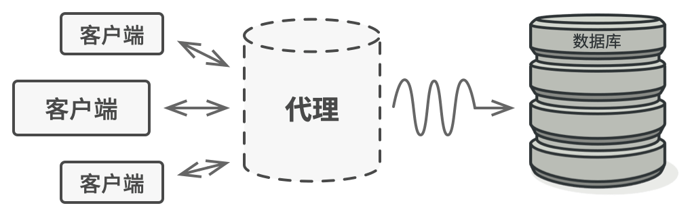

# 代理模式 （Proxy Pattern）

- 定义
  - 用一个（代理）类替另一个类实现功能

- 为什么要控制对于某个对象的访问呢？
  - 举个例子： 有这样一个消耗大量系统资源的巨型对象， 你只是偶尔需要使用它， 并非总是需要。
  - 你可以实现**延迟初始化**： 在实际有需要时再创建该对象。 对象的**所有客户端**都要执行延迟初始代码。 不幸的是， 这很可能会带来**很多重复代码**。
  - 在理想情况下， 我们希望将代码直接放入对象的类中， 但这并非总是能实现： 比如类可能是第三方封闭库的一部分。

- 解决方法：
  - 代理模式建议**新建**一个与原服务对象接口相同的**代理类**， 然后**更新**应用以将**代理**对象传递给所有原始对象客户端。 代理类接收到客户端请求后会创建实际的服务对象， 并将所有工作委派给它。
  - 
  - 这有什么好处呢？ 如果需要在类的**主要业务逻辑前后执行一些工作**， 你无需修改类就能完成这项工作。 由于代理实现的接口与原类相同， 因此你可将其传递给任何一个使用实际服务对象的客户端。

- 现实例子：
  - AOP
  - 买火车票不一定在火车站买，也可以去代售点
  - 去医院挂号很麻烦怎么办？找黄牛帮我们挂号

- 优点
  1. 职责清晰
  2. 高扩展性
  3. 智能化
  4. 开闭原则。 你可以在不对服务或客户端做出修改的情况下创建新代理。
  5. 如果客户端对服务对象的生命周期没有特殊要求， 你可以对生命周期进行管理。
  6. 即使服务对象还未准备好或不存在， 代理也可以正常工作。

- 缺点
  1. 由于在客户端和真实主题之间增加了代理对象，因此有些类型的代理模式可能会造成请求的处理速度变慢。
  2. 实现代理模式需要额外的工作，有些代理模式的实现非常复杂。

- 角色
  - 服务接口 （Service Interface）：
    - 声明了服务接口。 代理必须遵循该接口才能伪装成服务对象。
    - 图中的 Subject\<Interface\>
  - 服务 （Service） 类：
    - 提供了一些实用的业务逻辑。
    - 图中的Real Subject
  - 代理 （Proxy） 类：
    - 包含一个指向服务对象的引用成员变量。 代理完成其任务 （例如延迟初始化、 记录日志、 访问控制和缓存等） 后会将请求传递给服务对象。 通常情况下， 代理会对其服务对象的整个生命周期进行管理。
    - 图中的Proxy
  - 客户端 （Client） ：
    - 能通过同一接口与服务或代理进行交互， 所以你可在一切需要服务对象的代码中使用代理。
    - 图中的"realSubject.soSth()"
  -  

## 实现（静态代理）

- 这里有一个程序员接口，他们每天就是写代码

```java
public interface Programmer {
    // 程序员每天都写代码
    void coding();
}
```

- Java3y也是一个程序员，他也写代码(每个程序员写的代码都不一样，所以分了接口和实现类)

```java
public class Java3y implements Programmer {

    @Override
    public void coding() {
        System.out.println("Java3y最新文章：......给女朋友讲解什么是代理模式.......");
    }
}
```

- java3y懒得写文章，所以找ProgrammerBigV替他写
- 此外，有些平台不让自己给自己点赞，所以ProgrammerBigV替Java3y写文章后，也要点赞

```java
public class ProgrammerBigV implements Programmer {
    
    // 指定程序员大V要让谁发文章(先发文章、后点赞)
    private Java3y java3y ;

    public ProgrammerBigV(Java3y java3y) {
        this.java3y = java3y;
    }

    // 程序员大V点赞评论收藏转发
    public void upvote() {
        System.out.println("程序员大V点赞评论收藏转发！");
    }

    @Override
    public void coding() {

        // 让Java3y发文章
        java3y.coding();

        // 程序员大V点赞评论收藏转发！
        upvote();
    }
}
```

```java
public class Main {

    public static void main(String[] args) {

        // 想要发达的Java3y
        Java3y java3y = new Java3y();

        // 受委托程序员大V
        Programmer programmer = new ProgrammerBigV(java3y);

        // 受委托程序员大V让Java3y发文章，大V(自己)来点赞
        programmer.coding();
    }  
}
```

## 透明代理(普通代理)
- 如果程序员大V只做Java3y的生意，可以改成：

```java
public class ProgrammerBigV implements Programmer {
    // 指定程序员大V要给Java3y点赞
    private Java3y java3y ;

    // 只做Java3y的生意了
    public ProgrammerBigV() {
        this.java3y = new Java3y(); // 直接new Java3y
    }

    // 程序员大V点赞评论收藏转发
    public void upvote() {
        System.out.println("程序员大V点赞评论收藏转发！");
    }

    @Override
    public void coding() {
        // 让Java3y发文章了
        java3y.coding();
        // 程序员大V点赞评论收藏转发！
        upvote();
    }
}
```

```java
public class Main {
    public static void main(String[] args) {
        // 受委托程序员大V（不用创建Java3y，然后输入进ProgrammerBigV）
        Programmer programmer = new ProgrammerBigV();
        // 受委托程序员大V让Java3y发文章，大V来点赞
        programmer.coding();
    }
}
```

## 动态代理

- 静态代理需要自己写代理类：
  - 代理类需要实现与目标对象相同的**接口**
  - 如果目标对象的接口有很**多方法**的话，那我们还是得一一实现，这样就会比较麻烦

- 而动态代理**不需要自己编写代理类**；(是动态生成的)
  - 代理对象的生成，是利用JDK API，动态地在内存中构建代理对象(需要我们指定创建 代理对象/目标对象 实现的接口的类型)，并且会默认实现接口的全部方法。

```java
public class Main {
    public static void main(String[] args1) {
        // Java3y请水军
        Java3y java3y = new Java3y();

        Programmer programmerWaterArmy = (Programmer) Proxy.newProxyInstance(java3y.getClass().getClassLoader(), java3y.getClass().getInterfaces(), (proxy, method, args) -> {
            // 如果是调用coding方法，那么水军就要点赞了
            if (method.getName().equals("coding")) {
                method.invoke(java3y, args);
                System.out.println("我是水军，我来点赞了！");
            } else {
                // 如果不是调用coding方法，那么调用原对象的方法
                return method.invoke(java3y, args);
            }
            return null;
        });
        // 替Java3y写完文章后，水军会点赞
        programmerWaterArmy.coding();
    }
}
```

## TODO

- 使用场景：按职责来划分，通常有以下使用场景：
  1. 远程代理。(TODO: research)
  2. 虚拟代理。(TODO: research)
  3. Copy-on-Write 代理。(TODO: research)
  4. 保护（Protect or Access）代理。
  5. Cache代理。
  6. 防火墙（Firewall）代理。
  7. 同步化（Synchronization）代理。
  8. 智能引用（Smart Reference）代理。

## Source

  - https://zhuanlan.zhihu.com/p/36550730
  - https://www.runoob.com/design-pattern/proxy-pattern.html
  - https://refactoringguru.cn/design-patterns/proxy
